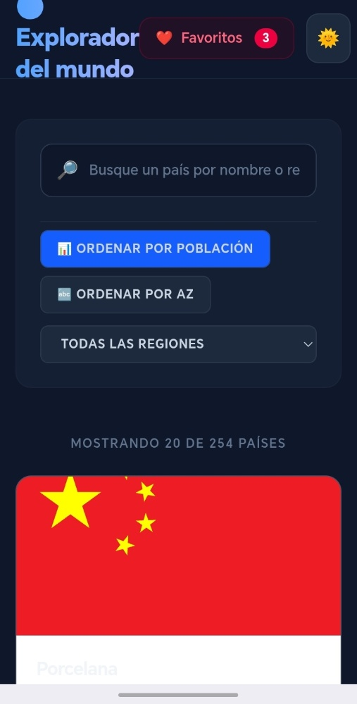

# 🌍 World Explorer v2

> Aplicación SPA de exploración de países del mundo construida con **TypeScript vanilla**, sin frameworks de UI. Arquitectura en capas, estado reactivo con patrón Observer, caché offline con IndexedDB y CI/CD automatizado con GitHub Actions.

<p align="center">
  
  
  
  
  
</p>

---

## Tabla de contenido

- [Demo](#demo)
- [¿Qué hace esta aplicación?](#qué-hace-esta-aplicación)
- [Características](#características)
- [Arquitectura](#arquitectura)
- [Flujo de datos](#flujo-de-datos)
- [Stack técnico](#stack-técnico)
- [Instalación](#instalación)
- [Scripts disponibles](#scripts-disponibles)
- [Testing](#testing)
- [CI/CD](#cicd)
- [Decisiones técnicas](#decisiones-técnicas)
- [Roadmap](#roadmap)
- [Lecciones aprendidas](#lecciones-aprendidas)
- [Autor](#autor)

## Demo

🔗 **[joseph160997.github.io/countries--app](https://joseph160997.github.io/countries--app/)**

![World Explorer imagenes]

<p align="center">
  
  
</p>

---

## ¿Qué hace esta aplicación?

World Explorer consume la [REST Countries API v5](https://api.restcountries.com) para mostrar información de todos los países del mundo. El usuario puede buscar, filtrar, ordenar y marcar favoritos — todo sin recargar la página y con soporte offline gracias a IndexedDB.

---

## Características

- **Búsqueda en tiempo real** con debounce optimizado (350ms)
- **Filtrado por región** (África, Américas, Asia, Europa, Oceanía)
- **Ordenación** por población descendente o nombre A-Z, persistida entre sesiones
- **Favoritos** guardados en `localStorage`, sin backend
- **Paginación virtual** — carga 20 países por página, todo en RAM
- **Modal de detalle** con navegación entre países fronterizos
- **Modo oscuro / claro** con detección de preferencia del sistema
- **Caché offline** — estrategia _cache-first_ con IndexedDB (TTL: 24h)
- **Skeleton loading** — feedback visual durante la carga inicial
- **Diseño responsive** — mobile-first con Tailwind CSS v4

---

## Arquitectura

El proyecto sigue una arquitectura en capas estricta donde cada módulo tiene **una única responsabilidad**. El dato fluye en una sola dirección: de la API hasta el DOM.

```
REST Countries API
        │
        ▼
  [ Validator ]          ← Valida que el JSON tiene la forma esperada (Type Guards)
        │
        ▼
  [ Mapper ]             ← Transforma RestCountryDTO → Country (modelo de UI)
        │
        ▼
  [ countryService ]     ← Orquesta red, caché e IndexedDB (estrategia cache-first)
        │
        ▼
  [ countryState ]       ← Estado global con patrón Observer + motor de filtros
        │
        ▼
  [ UI / main.ts ]       ← Suscriptores que renderizan el DOM cuando el estado cambia
```

### Estructura de archivos

```
src/
├── components/
│   ├── countryCards.ts     # Renderiza tarjetas y modal de detalle
│   ├── emptyState.ts       # Estado vacío (sin resultados / sin favoritos)
│   ├── layout.ts           # Header, main, footer (HTML estático inyectado al inicio)
│   └── skeleton.ts         # Grid de tarjetas placeholder durante la carga
│
├── mappers/
│   └── CountryMapper.ts    # DTO → Country. Función pura, sin efectos secundarios
│
├── services/
│   ├── countryService.ts   # Orquestación: red → validación → mapeo → caché
│   ├── favoriteService.ts  # CRUD de favoritos sobre localStorage
│   └── themeService.ts     # Toggle y persistencia del tema visual
│
├── state/
│   └── countryState.ts     # Estado global, filtros, paginación y Observer
│
├── types/
│   ├── Country.ts          # Modelo de dominio de la UI
│   └── RestCountryDTO.ts   # Contrato con la API externa
│
├── utils/
│   ├── db.ts               # Abstracción genérica sobre IndexedDB
│   ├── debounce.ts         # Utilidad de antirrebote con cancelación manual
│   ├── http.ts             # Cliente HTTP con timeout, validación y abort
│   ├── localStorage.ts     # Wrapper tipado sobre localStorage
│   └── toast.ts            # Sistema de notificaciones visuales flotantes
│
├── validators/
│   └── restCountriesValidator.ts  # Type Guards para validar la respuesta de la API
│
└── main.ts                 # Punto de entrada: inicialización, eventos y arranque
```

---

## Flujo de datos

```
Usuario escribe en el input
        │
        ▼
debounce(350ms)             ← Evita llamadas excesivas al estado
        │
        ▼
setSearchQuery(text)        ← Actualiza el estado privado
        │
        ▼
applyFilters()              ← Recalcula filteredCountries[]
        │
        ▼
notify()                    ← Avisa a todos los listeners suscritos
        │
        ▼
renderUI()                  ← Vuelca el estado al DOM con innerHTML
```

---

## Stack técnico

| Categoría     | Tecnología                      | Decisión                              |
| ------------- | ------------------------------- | ------------------------------------- |
| Lenguaje      | TypeScript 5.9 en modo `strict` | Sin `any`, sin excepciones            |
| Bundler       | Vite 7                          | HMR instantáneo, build optimizado     |
| Estilos       | Tailwind CSS v4                 | Utility-first, sin CSS custom         |
| Testing       | Vitest + jsdom                  | Colocación de tests junto al código   |
| Linting       | ESLint + `@typescript-eslint`   | Reglas estrictas de tipos             |
| Formato       | Prettier                        | Consistencia automática               |
| CI/CD         | GitHub Actions                  | Lint → Format → Build → Test → Deploy |
| Caché offline | IndexedDB (nativo)              | Sin librerías externas                |
| Persistencia  | localStorage                    | Favoritos y preferencias              |

---

## Instalación

### Requisitos

- Node.js 18+
- npm 9+

### Pasos

```bash
# 1. Clonar el repositorio
git clone https://github.com/tuusuario/countries--app.git
cd countries--app

# 2. Instalar dependencias
npm install

# 3. Configurar variables de entorno
cp .env.example .env
# Editar .env y añadir tu API key de REST Countries v5
```

### Variables de entorno

```env
VITE_COUNTRIES_API_KEY=tu_api_key_aqui
```

> Puedes obtener una API key gratuita en [api.restcountries.com](https://api.restcountries.com).

---

## Scripts disponibles

```bash
npm run dev           # Servidor de desarrollo con HMR
npm run build         # Compilación de producción (tsc + vite build)
npm run preview       # Previsualización del build de producción
npm run test          # Ejecutar tests una vez (modo CI)
npm run test:ui       # Tests con interfaz gráfica interactiva
npm run lint          # Análisis estático con ESLint
npm run lint:fix      # Corrección automática de errores de lint
npm run format        # Formatear código con Prettier
npm run format:check  # Verificar formato sin modificar archivos
npm run ci            # Pipeline completo: lint + format + build + test
```

---

## Testing

El proyecto incluye tests unitarios para las tres capas con lógica pura: el mapper, los servicios y el estado.

```bash
npm run test          # Todos los tests
npm run test:ui       # Tests con UI interactiva (Vitest UI)
```

### Cobertura por módulo

| Módulo            | Tests    | Qué se prueba                                                |
| ----------------- | -------- | ------------------------------------------------------------ |
| `CountryMapper`   | 12 tests | Transformación de DTO, fallbacks de capital/bandera/región   |
| `favoriteService` | 10 tests | CRUD de favoritos, validación de datos corruptos             |
| `countryState`    | 24 tests | Carga, filtros, paginación, modal, favoritos, sort, Observer |

### Filosofía de testing

- **Tests unitarios** sobre funciones puras: el mapper no necesita red ni DOM.
- **Mocks de dependencias externas**: `localStorage`, `toast` y `countryService` se reemplazan con `vi.mock()` — los tests son rápidos y deterministas.
- **Patrón AAA** (Arrange / Act / Assert) en todos los tests para máxima legibilidad.

---

## CI/CD

El pipeline se ejecuta automáticamente en cada `push` a `main` o `develop` y en cada Pull Request.

```
git push
    │
    ▼
GitHub Actions (CI)
    ├── npm run format:check   ← Formato consistente
    ├── npm run lint           ← Sin errores de tipos
    ├── npm run build          ← Compila sin errores
    └── npm run test           ← Todos los tests pasan
              │
              ▼ (solo en main, si CI pasa)
    GitHub Actions (Deploy)
    └── npm run build          ← Build con secrets de producción
              │
              ▼
    GitHub Pages               ← Deploy automático
```

---

## Decisiones técnicas

### ¿Por qué sin framework de UI?

React o Vue añaden una capa de abstracción que oculta cómo funciona el DOM. El objetivo de este proyecto era construir desde cero un gestor de estado reactivo, entender el patrón Observer y comprender qué problema resuelven los frameworks, no solo cómo usarlos.

### ¿Por qué la estrategia cache-first?

La API de REST Countries tiene datos que cambian raramente (fronteras, capitales, monedas). Hacer un fetch en cada visita es innecesario. Con IndexedDB como caché de 24 horas, la aplicación carga instantáneamente en visitas repetidas y funciona offline.

### ¿Por qué Type Guards en lugar de Zod?

Zod es excelente, pero añade una dependencia externa. Los Type Guards son TypeScript puro y enseñan el mismo concepto de validación en runtime. Para una aplicación de esta escala, la complejidad añadida no se justifica.

### ¿Por qué `innerHTML` en lugar de `appendChild`?

El patrón de renderizado es intencional: cada llamada a `renderUI()` reconstruye el fragmento completo de HTML como string y lo vuelca con `innerHTML`. Es el mismo principio que el Virtual DOM de React (comparar y reemplazar), pero sin diferenciación — para este volumen de datos es suficientemente rápido y mucho más sencillo de razonar.

---

## Roadmap

- [ ] Página de detalle de país con URL propia (`/country/:cca3`)
- [ ] Filtro por rango de población con slider
- [ ] Internacionalización (i18n) — soporte para español e inglés
- [ ] Service Worker para soporte offline completo (PWA)
- [ ] Conectar el formulario de feedback a un backend (Supabase o similar)
- [ ] Aumentar cobertura de tests al 90%+ con tests de integración

---

## Lecciones aprendidas

**El patrón Observer escala sorprendentemente bien** para aplicaciones medianas. La separación entre "quién cambia el estado" y "quién reacciona al cambio" hace el código mucho más fácil de depurar.

**Los Type Guards son más poderosos de lo que parecen.** Una función `isRestCountriesResponse()` bien escrita actúa como contrato entre la API y tu aplicación — si la API cambia su estructura, lo sabrás en runtime, no cuando el usuario vea un crash.

**IndexedDB tiene una API horrible, pero la abstracción lo resuelve.** Envolver las operaciones en Promesas y crear un servicio genérico (`storage.get`, `storage.save`) hizo que el resto de la aplicación olvidara completamente que estaba usando IndexedDB.

**El modo `strict` de TypeScript es incómodo al principio y esencial después.** Fuerza a pensar en cada `undefined` posible, lo que elimina una clase entera de bugs en runtime.

---

## Autor

**Joseph**

- GitHub: [@joseph160997](https://github.com/joseph160997)
- LinkedIn: [linkedin.com/in/joseph160997](https://linkedin.com/in/joseph160997)
- Portfolio: [joseph160997.github.io](https://joseph160997.github.io)

---

<p align="center">Construido con TypeScript puro · Sin frameworks · Con mucho café ☕</p>
